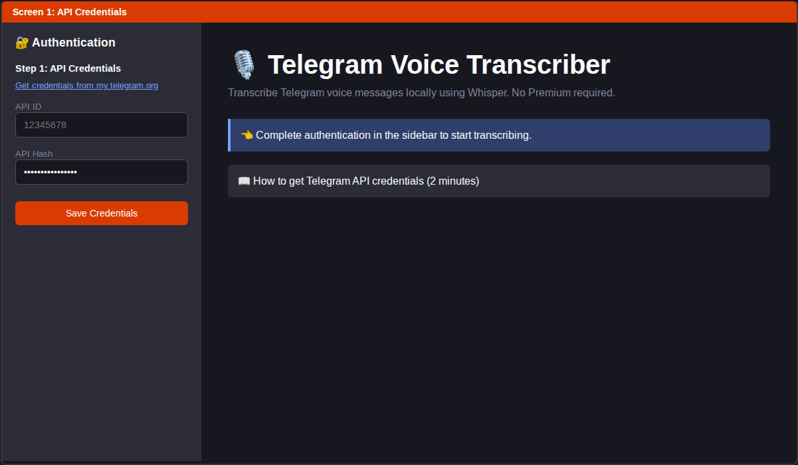

# Telegram Voice Transcriber

**Local-first Telegram voice transcription. No Telegram Premium required.**




## Features

- Privacy-first processing on your own machine
- Works with Telegram's free API (no premium dependency)
- Streamlit web UI and automation-friendly CLI
- Date/sender/type filtering for targeted exports
- Resumable pipeline with persisted state
- Markdown export for downstream notes and workflows

## Screenshots

| Login | Chat Selection |
|-------|----------------|
|  |  |

| Processing | Result |
|------------|--------|
|  |  |

## Quick Start

### Web UI (recommended)

```bash
python -m pip install -e '.[dev]'
cp .env.example .env
streamlit run app.py
```

### CLI

```bash
export TG_API_ID=your_id
export TG_API_HASH=your_hash
tg-transcribe "Chat Name" --year 2025
```

### Docker

```bash
docker build -t telegram-transcriber .
docker run -p 8501:8501 telegram-transcriber
```

## Environment Variables

### Required

- `TG_API_ID`: Telegram API ID from `my.telegram.org`
- `TG_API_HASH`: Telegram API Hash from `my.telegram.org`

### Optional

- `WHISPER_MODEL`: default transcription model (default: `small`)
- `WHISPER_LANGUAGE`: language hint for Whisper (default: `de`)

Reference: [`.env.example`](.env.example)

## Privacy and Data Retention

Sensitive local data locations:
- Telegram session material:
  - CLI session file (default under your selected `--data-dir`, typically `telegram.session`)
  - Web session file: `.data/web.session.txt`
- Transcription outputs:
  - Markdown export at `<data-dir>/<chat>/<year>/output/<chat>-<year>.md`
- Cache/temp files:
  - Download cache at `<data-dir>/<chat>/<year>/cache/`
  - Pipeline state at `<data-dir>/<chat>/<year>/state/state.json`
  - Web logs at `.data/web/logs/app.log`

Retention guidance:
- Delete session files when moving machines or after temporary use.
- Treat exported markdown as sensitive source material.
- Periodically clear cache/state folders when no longer needed.

## Getting Telegram API Credentials

1. Go to [my.telegram.org](https://my.telegram.org)
2. Log in with your phone number
3. Enter the code sent via Telegram app
4. Open "API development tools"
5. Create an app and copy `API ID` + `API Hash`

## How It Works

1. Authenticate with Telegram
2. Select chat, date range, and message filters
3. Download and transcribe voice messages locally
4. Export markdown grouped for practical review

## Requirements

- Python 3.10+
- `ffmpeg` (`sudo apt install ffmpeg` on Ubuntu)
- ~2GB disk space for Whisper models (first run)

## Development

```bash
python -m pip install -e '.[dev]'
pytest -q
```

### Test Matrix

- Unit tests: pure module behavior (`config`, `filters`, `state`, exporters)
- CLI tests: command parsing and configuration wiring
- Integration-like tests: pipeline orchestration with mocked external calls

Coverage command:

```bash
pytest --cov=telegram_voice_transcriber --cov-report=term-missing
```

## Contributing

- [Contributing Guide](CONTRIBUTING.md)
- [Code of Conduct](CODE_OF_CONDUCT.md)
- [Issue Templates](.github/ISSUE_TEMPLATE)
- [Pull Request Template](.github/PULL_REQUEST_TEMPLATE.md)

## Security

See [SECURITY.md](SECURITY.md) for vulnerability reporting, local threat model notes, and secure runtime practices.

## License

MIT
